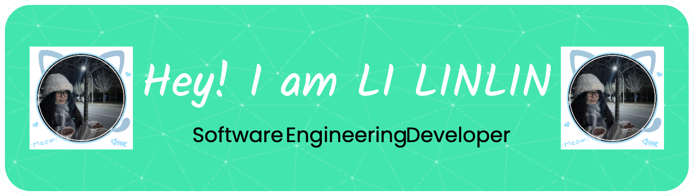

# Hi there, I'm LI LINLIN 👋

  

 

## 🚀 About Me
I am a passionate **Software Engineering (Software Technology) postgraduate student** who loves my profession. Here's a more information about me:

- 🌱 **I am currently learning**: framework-based software design and development, UX,software engineering management and practice, and more. My goal is to become proficient and apply what I have learned.
- 💬 **You can ask me**: full stack development, Python, Java , database management or anything related to technology!

- 📫 **How to Reach Me**: My Email:23095061@siswa.um.edu.my | LinkedIn: www.linkedin.com/in/linlin666666 
- 😄 **Pronouns**: He/Him or She/Her or They/Them
- ⚡ **interesting fact**: I like to find simpler ways to design software engineering projects

---

## 🛠️ Tech Stack
Here are some of the tools and technologies I work with:

### Languages

### Frameworks & Libraries

### Tools & Platforms

## 📫 Let's Connect!
I'm always open to collaborating on interesting projects or discussing new ideas. Feel free to reach out:

- [LinkedIn](www.linkedin.com/in/linlin666666)
- [Email](23095061@siswa.um.edu.my)

 

**Thanks for watching🥰**

---

  

